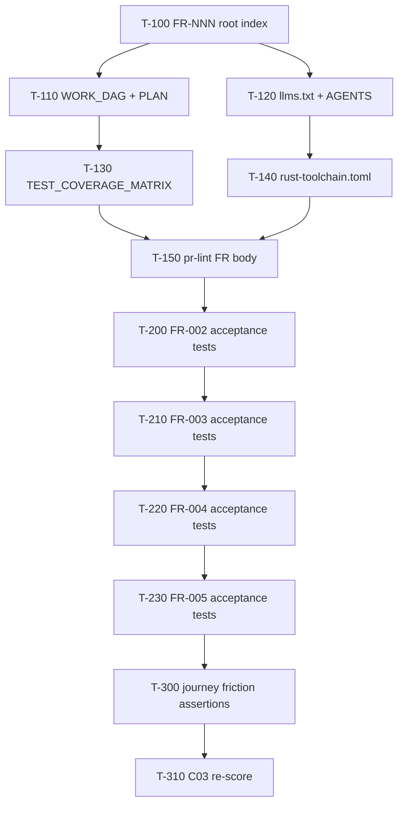

# sharecli Work DAG

Atomic, FR-linked tasks agents can claim independently (effort ≤ M ≈ 4h).

## Claim protocol

1. Pick a task with **Status = READY** whose predecessors are **DONE**.
2. Branch `feat/sharecli-t<id>-<slug>` (or claim on the active lane branch).
3. Cite the FR ID in the PR body (`FR-NNN` section).
4. Done when: acceptance tests listed pass locally (`just test`) and CI is green.

## Ready / in-flight

| ID | Task | FR / pillar | Pred | Effort | Status | Done when |
|----|------|-------------|------|--------|--------|-----------|
| T-100 | Rewrite root FRs to FR-NNN + role stories | L30.1 / FR-001..005 | — | S | DONE | `FUNCTIONAL_REQUIREMENTS.md` uses FR-NNN + Acceptance refs |
| T-110 | Replace phase PLAN with claimable WORK_DAG | L30.2 | T-100 | S | DONE | `WORK_DAG.md` has ≥5 S/M tasks with FR refs |
| T-120 | Add `llms.txt` + expand `AGENTS.md` entrypoint | L30.4 / L30.11 | — | S | DONE | Build/test/lint/key-files/forbidden present |
| T-130 | Fill `TEST_COVERAGE_MATRIX.md` TBDs from tree | L30.3 | T-100 | S | DONE | No TBD in FR mapping rows for FR-001..005 |
| T-140 | Pin `rust-toolchain.toml` (stable + components) | L30.5 | — | S | DONE | File present; matches CI `dtolnay/rust-toolchain@stable` |
| T-150 | PR lint: require `FR-` in PR body | L30.8 | T-100 | S | DONE | `.github/workflows/pr-lint.yml` fails empty FR section |
| T-160 | Friction log + journey FR map (quick) | L30.6 / L30.12 | T-100 | S | DONE | `docs/friction-log.md` + journey index cites FRs |

## Backlog (claimable next)

| ID | Task | FR / pillar | Pred | Effort | Status | Done when |
|----|------|-------------|------|--------|--------|-----------|
| T-200 | Land `tests/fr002_*.rs` acceptance suite | FR-002 | T-130 | M | DONE | TRACEABILITY AC-002.* functions exist & pass |
| T-210 | Land `tests/fr003_*.rs` acceptance suite | FR-003 | T-200 | M | DONE | TRACEABILITY AC-003.* functions exist & pass |
| T-220 | Land `tests/fr004_*.rs` acceptance suite | FR-004 | T-210 | M | DONE | TRACEABILITY AC-004.* functions exist & pass |
| T-230 | Land `tests/fr005_*.rs` acceptance suite | FR-005 | T-220 | M | DONE | TRACEABILITY AC-005.* functions exist & pass |
| T-240 | Outside-in journey test (`*_journey_*`) | FR-001..003 / L30.6 | T-160 | M | DONE | One CLI journey test maps steps → FR IDs |
| T-250 | Golden CLI/TUI snapshot fixtures | L30.7 | T-240 | M | DONE | `tests/golden/` has ≥3 committed fixtures |
| T-260 | Multi-agent file ownership protocol in AGENTS | L30.9 | T-120 | S | DONE | Explicit claim-lock section for shared paths |
| T-270 | Publish local loop timing budgets | L30.10 | T-140 | S | DONE | `docs/ops/` or AGENTS lists measured `just test` budget |
| T-300 | Unhappy-path friction tests (`_invalid_` / `_missing_`) | L30.12 | T-230 | M | DONE | ≥1 unhappy-path test per FR-001..005 |
| T-310 | Re-score C03 in `audit/.lane-c03/C03.md` | audit | T-150,T-230 | S | DONE | Cluster ≥ C (≥60% with L30.1–.5 at ≥2) |
| T-311 | Final C03 L30.1/L30.3/L30.9 re-score | L30.1/L30.3/L30.9 | T-310,T-260 | S | DONE | C03 36/36 (100% A); `tests/c03_l30_agent_readiness_gate.rs` |

## Completed

| ID | Task | Status |
|----|------|--------|
| T-100..T-160 | Wave1 agent-readiness scaffolding | DONE (2026-07-10) |
| T-200 | FR-002 acceptance (`tests/fr002_*.rs`) | DONE (2026-07-12) |
| T-210 | FR-003 acceptance (`tests/fr003_*.rs`) | DONE (2026-07-12) |
| T-220 | FR-004 acceptance (`tests/fr004_*.rs`) | DONE (2026-07-12) |
| T-230 | FR-005 acceptance (`tests/fr005_*.rs`) | DONE (2026-07-13) |
| T-240 | Outside-in Quick Start journey (`tests/quick_start_journey.rs`) | DONE (2026-07-13) |
| T-250 | Golden CLI/TUI fixtures (`tests/golden/` + `golden_snapshots.rs`) | DONE (2026-07-13) |
| T-300 | Unhappy-path friction (`tests/fr_invalid_missing_friction.rs`) | DONE (2026-07-13) |
| T-310 | C03 re-score → 33/36 (92% A) | DONE (2026-07-13) |
| T-311 | C03 L30.1/L30.3/L30.9 → 36/36 (100% A) | DONE (2026-07-19) |
| T-260 | Claim-lock protocol in `AGENTS.md` | DONE (2026-07-12) |
| T-270 | Local loop budgets `docs/ops/LOCAL_LOOP_BUDGETS.md` | DONE (2026-07-12) |
| — | Phase roadmap in `PLAN.md` (weeks 1–8) | superseded by this DAG |
| — | Phased org+project WBS | `docs/ops/governance/WBS-PHASED.md` |
| — | Gap/QA matrix | `docs/ops/governance/GAP-QA-MATRIX.md` |
| — | PERT + parallel DAG Wave12 | `docs/ops/governance/PERT-DAG-W12.md` |
| — | RC snapshot ~91% A weighted | `docs/ops/governance/RC-audit-v38-80B.md` |
| T-450 | Governance sync WBS/GAP/DAG/RC/PERT (#325) | DONE (2026-07-17) |
| T-400 | Unify serve error envelope JSON (#330) | DONE (2026-07-18) |
| T-410 | proptest config roundtrip dep (#329) | DONE (2026-07-17) |
| T-420 | traceparent inject one CLI path (#328) | DONE (2026-07-17) |
| T-430 | Commit dashboard PNG baseline scaffold (#327) | DONE (2026-07-17) |
| T-440 | Harbor Phase 3 soak evidence plan (#326) | DONE (2026-07-17) |
| T-500 | OpenAPI ErrorEnvelope component (#332) | DONE (2026-07-18) |
| T-510 | PNG bytes commit + soft diff (#335) | DONE (2026-07-18) |
| T-520 | Harbor Phase 3 soak execution scaffold (#333) | DONE (2026-07-18) |
| T-530 | Trace IPC + tray injectors (#334) | DONE (2026-07-18) |
| T-550 | Wave13 governance closeout (#336) | DONE (2026-07-18) |
| T-600 | Deterministic dashboard visual hard gate (#339) | DONE (2026-07-19) |
| T-620 | Coverage llvm-cov snapshot artifact (#338) | DONE (2026-07-19) |
| T-640 | cargo-mutants soft→hard gate (C07 L65) | DONE (2026-07-18) |
| T-645 | Sync audit_scorecard.json to live SCORECARD | DONE (2026-07-19) |
| T-670 | C01 L12 FR SSOT gate | DONE (2026-07-19) |
| T-650 | C07 L66 proptest boundary + registry + replay (#364) | DONE (2026-07-19) |
| T-655 | OSV/GHSA hard gate (C04 L38) | DONE (2026-07-19) |
| T-660 | GHCR cosign sign/attest hard publish (C06 L56) | DONE (2026-07-18) |
| T-630 | Chaos restart ci-success hard gate (#337) | DONE (2026-07-19) |
| T-625 | Broad-workspace coverage numeric pin (C01 L11) | DONE (2026-07-19) |
| T-610 | Tray dashboard HTTP traceparent inject (#340) | DONE (2026-07-19) |

## Wave13 backlog (DONE)

| ID | Task | FR / pillar | Pred | Effort | Status | Done when |
|----|------|-------------|------|--------|--------|-----------|
| T-550 | Governance sync WBS/GAP/DAG/RC | audit | Wave13 W13.1–W13.4 | S | DONE | W13 rows match SCORECARD |

## Wave14 backlog (DONE)

| ID | Task | FR / pillar | Pred | Effort | Status | Done when |
|----|------|-------------|------|--------|--------|-----------|
| T-680 | Governance sync WBS/GAP/DAG/RC/SCORECARD | audit | Wave14 W14.1–W14.5 | S | DONE | W14 rows + lifts through #391 match SCORECARD |
| T-675 | Seven-day Harbor soak log completion (W14.2) | FR-003 / C08 L76 | T-520 | M | EXTRACTED | Tracked in benchora/`portage-temp` — not sharecli `main` (ADR 0002/0005) |

## Wave15 backlog

| ID | Task | FR / pillar | Pred | Effort | Status | Done when |
|----|------|-------------|------|--------|--------|-----------|
| T-685 | C10 L99 dashboard skeleton loading states | FR-003 / C10 L99 | T-680 | S | DONE | Skeletons + `loading-states.md` + `tests/c10_l99_skeleton_states.rs` (#396); L99 2→3 |
| T-690 | Governance reconcile after #392 (#396/#399) | audit | T-680 | S | DONE | SCORECARD v6 + T-660 DONE + `audit_scorecard.json` at `bba2411` |
| T-691 | Coverage pin refresh post-#399 | FR-003 / C01 L11 | T-685 | S | DONE | Measured **80.51%** lines @ `5d8dc08` (run 29985746034); matrix + pin gates cite real % |
| T-692 | Dashboard hex drift (token alignment) | FR-003 / C10 L105 | T-685 | M | DONE | Verified `assets/tokens.css` == `src/dashboard.html` `:root` 12/12 bb2 hexes + no hex outside root (`tests/c10_l105_hex_drift.rs` 3/3 C10 L105 gate); `src/theme.rs` mirror verified 2026-08-19 |

## Wave16 backlog (DONE - T-700..T-730 all DONE, queued C11/C05 live remain BLOCKED)

| ID | Task | FR / pillar | Pred | Effort | Status | Done when |
|----|------|-------------|------|--------|--------|-----------|
| T-700 | Wave16 kickoff - define backlog + queue blocked | audit | T-692 | S | DONE | Wave16 defined in `WORK_DAG.md` `e89755c` (#749) - queued C11 L112 / C05 L45+ live PD |
| T-710 | C05 L45+ soft Pyroscope push stub (no live PD) | FR-003 / C05 L45+ | T-700 | M | DONE | `src/pyroscope_stub.rs` + `tests/c05_pyroscope_stub.rs` 3/3 soft gate, `docs/ops/pyroscope-stub.md`, scope: stub only, no live push, no secrets |
| T-720 | C08 L76 Harbor soft gate stub (benchora port) | FR-003 / C08 L76 | T-700 | M | DONE | `docs/eval/harbor-soft-stub.md` + `tests/c08_harbor_soft_stub.rs` 3/3 soft gate, scope: doc stub only, EXTRACTED lane noted, no 7d log |
| T-730 | C01 coverage pin refresh (llvm-cov) | FR-003 / C01 L11 | T-700 | S | DONE | `TEST_COVERAGE_MATRIX.md` pin cited at `e89755c` 80.51% + snapshot (refresh, no new snapshot) `eb2b865` (#752) |

## Wave17 backlog (IN_PROGRESS - T-800/T-810/T-830/T-840/T-850/T-860/T-870/T-880 DONE, T-820 BLOCKED)

| ID | Task | FR / pillar | Pred | Effort | Status | Done when |
|----|------|-------------|------|--------|--------|-----------|
| T-800 | Wave17 kickoff - define backlog + queue blocked | audit | T-730 | S | DONE | Wave17 defined in `WORK_DAG.md` `eb2b865` - queued C11 L112 / C05 L45+ live PD |
| T-810 | C01 coverage lift toward 85% (nextest) — `--lib` pin @ `fa887e9` | FR-003 / C01 L11 | T-800 | M | DONE | `--lib --all-features --locked --ignore-run-fail` measured **77.34%** lines / **79.79%** funcs / **80.14%** regions @ `fa887e9` (local run `local-lib-20260827`); retained `audit/coverage-snapshots/fa887e9.coverage-snapshot.json`. Workspace-broad remeasure blocked on Windows by `tests/fr008_coalesce_mesh` operator-env critical-timeout hang + `tests/fr009_*` FUSE cfg-gate regressions; prior workspace pin **80.51%** @ `5d8dc08` retained as historical evidence. No invented %. PR #775 MERGED → main `691bde6`. |
| T-820 | C08 Harbor hard 7d soak (benchora) | FR-003 / C08 L76 | T-800 | M | BLOCKED | External artifact `benchora/harbor-soft/harbor-7d.log` live 7d soak remains EXTRACTED (lane `benchora/harbor-soft`, not tracked in `sharecli` `main`; local `docs/eval/harbor-soft-stub.md` is stub only) |
| T-830 | C10 residual polish (hex drift) | FR-003 / C10 L105 | T-800 | S | DONE | Verified 0 drift per T-692 (`assets/tokens.css` == `src/dashboard.html` `:root` 12/12 bb2 hexes, `tests/c10_l105_hex_drift.rs` 3/3); residual polish now doc-only |
| T-840 | C06 L53 SLSA Build L2 → L3 generator switch | FR-003 / C06 L53 | T-800 | S | DONE | `.github/workflows/release-attestation.yml` promoted from `slsa-framework/slsa-github-generator/attest-build-provenance@v1` (L2 action) to `slsa-framework/slsa-github-generator/.github/workflows/generator_containerized_slsa3.yml@v2` (L3 reusable workflow). C06 L53 2→3; C06 26/30 87% B → 27/30 90% A. Unweighted 90.1% A → 91.3% A; tier-1 91.3% A → 91.7% A. See `docs/ops/slsa-l3-plan.md` §Wave17 Plan 777. PR #776 MERGED → main `5a32630`. |
| T-850 | C06 L53 SLSA generator re-pin `@v2` → commit SHA | FR-003 / C06 L53 | T-840 | S | DONE | `.github/workflows/release-attestation.yml` re-pinned from mutable `@v2` tag to immutable commit SHA `5a775b367a56d5bd118a224a811bba288150a563` (slsa-framework/slsa-github-generator v2.0.0). Digest-pinned L3 hardening; C06 score unchanged at 27/30 90% A. See `docs/ops/slsa-l3-plan.md` §Wave17 Plan 778b. PR #777 MERGED → main `02c805a`. |
| T-860 | C04 L34 Verified commits 2→3 on verified merge evidence | FR-003 / C04 L34 | T-840 | S | DONE | 3 squash-merge commits on `main` `verified: true, reason: valid` via GitHub web-flow signing key (`691bde6` T-810, `5a32630` Plan 777, `02c805a` Plan 778b); bot signing/bypass policy documented (`gh pr merge --admin --squash`); ruleset `19181236` evidence **removed** (stale — repo-level rulesets `[]`); C04 L34 2→3; C04 26/30 87% B → 27/30 90% A. See `audit/.lane-c04/C04.md` L34 3 + `docs/ops/gpg-verified-commits-l34.md` bot signing/bypass policy. PR #780 MERGED → main `8f1990d`. |
| T-870 | C05 L49 Grafana provisioning as code 2→3 | FR-003 / C05 L49 | T-860 | M | DONE | `docs/ops/grafana/provisioning/datasources/prometheus.yaml` + `provisioning/dashboards/sharecli-providers.yaml` + `provisioning/manifests/sharecli-c05-manifest.json` (1 datasource + 1 provider + 3 dashboards + 1 audit manifest). Existing `sharecli-serve.json` moved to `dashboards/sharecli-serve.json`; new `sharecli-process.json` (fleet: up/RSS/CPU/saturation) and `sharecli-trace.json` (OTel span ingest + tracecontext inject/extract). `docs/ops/grafana/README.md` operation runbook + `docs/ops/grafana/deferred/org-wide-promotion.md` deferral note. C05 L49 2→3; C05 26/30 87% B → 27/30 90% A. Tier-1 unchanged (C05 not in tier-1). PR #781 MERGED → main `5ae9ec2`. |
| T-880 | C11 L111 soft auto-update probe 1→2 | FR-003 / C11 L111 | T-870 | M | DONE | `src/commands/upgrade.rs` ships `UpgradeChannel` enum (crates-io / cargo-binstall / homebrew / github-releases), `probe()`, `check()` CLI handler; `src/main.rs` wires `Commands::Upgrade { check, channel }` clap subcommand (no install path; soft contract). 6 FR-003 tests pass via `tests/c11_l111_soft_upgrade.rs` (probe + channel parsing + semver + docs + CLI wiring). **NO network egress**. C11 L111 1→2; C11 39/45 87% B → 40/45 89% B. Weighted 91.8% A → 92.0% A; tier-1 91.9% A → 92.0% A. Hard signed self-update / Sparkle / WinUI appcast deferred to L112 + TUF pipeline (`docs/ops/in-binary-updater.md`). PR TBD. |

## Ownership notes

- Do **not** claim tasks that touch `release.yml`, `Containerfile`, fuzz, benches, or `spawn-core` from the C03 FR-test lane alone — package those under Wave4 WBS IDs.
- Prefer worktrees: `git worktree add ../sharecli-wtrees/<lane> -b feat/sharecli-<lane>`.
- Always update Status tokens in this file + GAP-QA-MATRIX + TRACEABILITY when Done-when passes.
