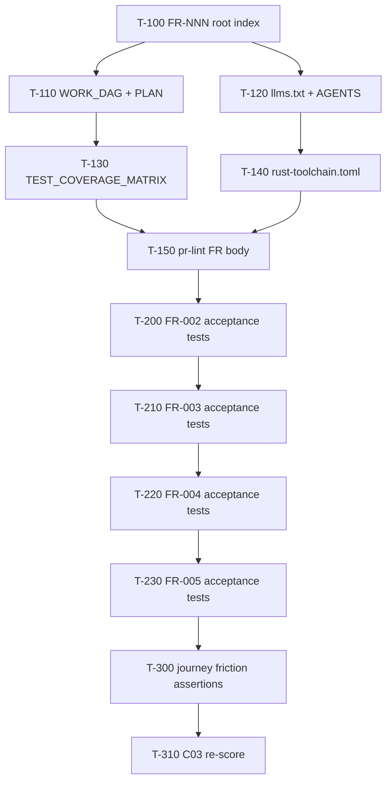

# sharecli Work DAG

Atomic, FR-linked tasks agents can claim independently (effort ≤ M ≈ 4h).

## Claim protocol

1. Pick a task with **Status = READY** whose predecessors are **DONE**.
2. Branch `feat/sharecli-t<id>-<slug>` (or claim on the active lane branch).
3. Cite the FR ID in the PR body (`FR-NNN` section).
4. Done when: acceptance tests listed pass locally (`just test`) and CI is green.

## Ready / in-flight

| ID | Task | FR / pillar | Pred | Effort | Status | Done when |
|----|------|-------------|------|--------|--------|-----------|
| T-100 | Rewrite root FRs to FR-NNN + role stories | L30.1 / FR-001..005 | — | S | DONE | `FUNCTIONAL_REQUIREMENTS.md` uses FR-NNN + Acceptance refs |
| T-110 | Replace phase PLAN with claimable WORK_DAG | L30.2 | T-100 | S | DONE | `WORK_DAG.md` has ≥5 S/M tasks with FR refs |
| T-120 | Add `llms.txt` + expand `AGENTS.md` entrypoint | L30.4 / L30.11 | — | S | DONE | Build/test/lint/key-files/forbidden present |
| T-130 | Fill `TEST_COVERAGE_MATRIX.md` TBDs from tree | L30.3 | T-100 | S | DONE | No TBD in FR mapping rows for FR-001..005 |
| T-140 | Pin `rust-toolchain.toml` (stable + components) | L30.5 | — | S | DONE | File present; matches CI `dtolnay/rust-toolchain@stable` |
| T-150 | PR lint: require `FR-` in PR body | L30.8 | T-100 | S | DONE | `.github/workflows/pr-lint.yml` fails empty FR section |
| T-160 | Friction log + journey FR map (quick) | L30.6 / L30.12 | T-100 | S | DONE | `docs/friction-log.md` + journey index cites FRs |

## Backlog (claimable next)

| ID | Task | FR / pillar | Pred | Effort | Status | Done when |
|----|------|-------------|------|--------|--------|-----------|
| T-200 | Land `tests/fr002_*.rs` acceptance suite | FR-002 | T-130 | M | DONE | TRACEABILITY AC-002.* functions exist & pass |
| T-210 | Land `tests/fr003_*.rs` acceptance suite | FR-003 | T-200 | M | DONE | TRACEABILITY AC-003.* functions exist & pass |
| T-220 | Land `tests/fr004_*.rs` acceptance suite | FR-004 | T-210 | M | DONE | TRACEABILITY AC-004.* functions exist & pass |
| T-230 | Land `tests/fr005_*.rs` acceptance suite | FR-005 | T-220 | M | DONE | TRACEABILITY AC-005.* functions exist & pass |
| T-240 | Outside-in journey test (`*_journey_*`) | FR-001..003 / L30.6 | T-160 | M | DONE | One CLI journey test maps steps → FR IDs |
| T-250 | Golden CLI/TUI snapshot fixtures | L30.7 | T-240 | M | DONE | `tests/golden/` has ≥3 committed fixtures |
| T-260 | Multi-agent file ownership protocol in AGENTS | L30.9 | T-120 | S | DONE | Explicit claim-lock section for shared paths |
| T-270 | Publish local loop timing budgets | L30.10 | T-140 | S | DONE | `docs/ops/` or AGENTS lists measured `just test` budget |
| T-300 | Unhappy-path friction tests (`_invalid_` / `_missing_`) | L30.12 | T-230 | M | DONE | ≥1 unhappy-path test per FR-001..005 |
| T-310 | Re-score C03 in `audit/.lane-c03/C03.md` | audit | T-150,T-230 | S | DONE | Cluster ≥ C (≥60% with L30.1–.5 at ≥2) |
| T-311 | Final C03 L30.1/L30.3/L30.9 re-score | L30.1/L30.3/L30.9 | T-310,T-260 | S | DONE | C03 36/36 (100% A); `tests/c03_l30_agent_readiness_gate.rs` |

## Completed

| ID | Task | Status |
|----|------|--------|
| T-100..T-160 | Wave1 agent-readiness scaffolding | DONE (2026-07-10) |
| T-200 | FR-002 acceptance (`tests/fr002_*.rs`) | DONE (2026-07-12) |
| T-210 | FR-003 acceptance (`tests/fr003_*.rs`) | DONE (2026-07-12) |
| T-220 | FR-004 acceptance (`tests/fr004_*.rs`) | DONE (2026-07-12) |
| T-230 | FR-005 acceptance (`tests/fr005_*.rs`) | DONE (2026-07-13) |
| T-240 | Outside-in Quick Start journey (`tests/quick_start_journey.rs`) | DONE (2026-07-13) |
| T-250 | Golden CLI/TUI fixtures (`tests/golden/` + `golden_snapshots.rs`) | DONE (2026-07-13) |
| T-300 | Unhappy-path friction (`tests/fr_invalid_missing_friction.rs`) | DONE (2026-07-13) |
| T-310 | C03 re-score → 33/36 (92% A) | DONE (2026-07-13) |
| T-311 | C03 L30.1/L30.3/L30.9 → 36/36 (100% A) | DONE (2026-07-19) |
| T-260 | Claim-lock protocol in `AGENTS.md` | DONE (2026-07-12) |
| T-270 | Local loop budgets `docs/ops/LOCAL_LOOP_BUDGETS.md` | DONE (2026-07-12) |
| — | Phase roadmap in `PLAN.md` (weeks 1–8) | superseded by this DAG |
| — | Phased org+project WBS | `docs/ops/governance/WBS-PHASED.md` |
| — | Gap/QA matrix | `docs/ops/governance/GAP-QA-MATRIX.md` |
| — | PERT + parallel DAG Wave12 | `docs/ops/governance/PERT-DAG-W12.md` |
| — | RC snapshot ~82% B | `docs/ops/governance/RC-audit-v38-80B.md` |
| T-450 | Governance sync WBS/GAP/DAG/RC/PERT (#325) | DONE (2026-07-17) |
| T-400 | Unify serve error envelope JSON (#330) | DONE (2026-07-18) |
| T-410 | proptest config roundtrip dep (#329) | DONE (2026-07-17) |
| T-420 | traceparent inject one CLI path (#328) | DONE (2026-07-17) |
| T-430 | Commit dashboard PNG baseline scaffold (#327) | DONE (2026-07-17) |
| T-440 | Harbor Phase 3 soak evidence plan (#326) | DONE (2026-07-17) |
| T-500 | OpenAPI ErrorEnvelope component (#332) | DONE (2026-07-18) |
| T-510 | PNG bytes commit + soft diff (#335) | DONE (2026-07-18) |
| T-520 | Harbor Phase 3 soak execution scaffold (#333) | DONE (2026-07-18) |
| T-530 | Trace IPC + tray injectors (#334) | DONE (2026-07-18) |
| T-550 | Wave13 governance closeout (#336) | DONE (2026-07-18) |
| T-600 | Deterministic dashboard visual hard gate | DONE (2026-07-18) |
| T-620 | Coverage evidence pin + llvm-cov snapshot artifact | DONE (2026-07-18) |
| T-640 | cargo-mutants soft→hard gate (C07 L65) | DONE (2026-07-18) |
| T-645 | Sync audit_scorecard.json to live SCORECARD | DONE (2026-07-19) |
| T-670 | C01 L12 FR SSOT gate | DONE (2026-07-19) |
| T-650 | C07 L66 proptest boundary + registry + replay | DONE (2026-07-19) |

## Wave13 backlog (DONE)

| ID | Task | FR / pillar | Pred | Effort | Status | Done when |
|----|------|-------------|------|--------|--------|-----------|
| T-550 | Governance sync WBS/GAP/DAG/RC | audit | Wave13 W13.1–W13.4 | S | DONE | W13 rows match SCORECARD |

## Wave14 backlog (IN_PROGRESS)

| ID | Task | FR / pillar | Pred | Effort | Status | Done when |
|----|------|-------------|------|--------|--------|-----------|
| T-600 | Promote dashboard PNG diff to deterministic hard gate | FR-003 / C10 L107 | T-510,T-550 | S | DONE | Ubuntu capture is deterministic and visual diff blocks on failure |
| T-645 | Sync machine `audit_scorecard.json` to live SCORECARD | audit | T-550 | S | DONE | JSON cluster pct/grade/score + overall_pct/grade/date match `audit/SCORECARD-v38.md` Category Scores |
| T-640 | Mutants soft→hard gate (C07 L65) | FR-003 / C07 L65 | T-550 | M | DONE | No `continue-on-error`; `ci-success` needs `mutants`; L65 2→3; C07 80% B |
| T-655 | OSV/GHSA hard gate (C04 L38) | FR-003 / C04 L38 | T-550 | S | DONE | No soft shim; `ci.yml` `osv` + `ci-success`; L38 2→3; C04 83% B |
| T-630 | Chaos restart ci-success hard gate (C05 L50) | FR-003 / C05 L50 | T-550 | S | DONE | `ci.yml` `chaos-restart-hard` + `ci-success`; L50 2→3; C05 83% B |
| T-650 | Seven-day Harbor soak log completion (W14.2) | FR-003 / C08 L76 | T-520 | M | IN_PROGRESS | Seven consecutive `main` `harbor-eval-stub-soft.yml` STUB PASS rows logged; local soft soak alone does not close |
| T-625 | Broad-workspace coverage numeric pin (C01 L11) | FR-003 / C01 L11 | T-620 | S | DONE | Matrix pins 83.48% lines; `audit/coverage-snapshots/d3cb7c4.coverage-snapshot.json`; L11 2→3; C01 83% B |
| T-670 | FR↔acceptance-test SSOT gate (C01 L12) | FR-003 / C01 L12 | T-625 | S | DONE | `tests/c01_fr_ssot_gate.rs`; FR-001..005 Acceptance refs on disk; L12 2→3; C01 87% B |
| T-660 | GHCR cosign sign/attest hard publish (C06 L56) | C06 L56 | T-550 | M | READY | Keyless cosign on GHCR; soft→hard; L56 2→3 |

## Wave14 evidence hardening (IN_PROGRESS)

| ID | Task | FR / pillar | Pred | Effort | Status | Done when |
|----|------|-------------|------|--------|--------|-----------|
| T-620 | Pin measured coverage evidence and automate snapshot | FR-003 / C01 L11 | T-550 | S | DONE | Matrix cites a successful base-SHA run without inventing a percentage; CI retains machine-readable llvm-cov totals |

## Ownership notes

- Do **not** claim tasks that touch `release.yml`, `Containerfile`, fuzz, benches, or `spawn-core` from the C03 FR-test lane alone — package those under Wave4 WBS IDs.
- Prefer worktrees: `git worktree add ../sharecli-wtrees/<lane> -b feat/sharecli-<lane>`.
- Always update Status tokens in this file + GAP-QA-MATRIX + TRACEABILITY when Done-when passes.
