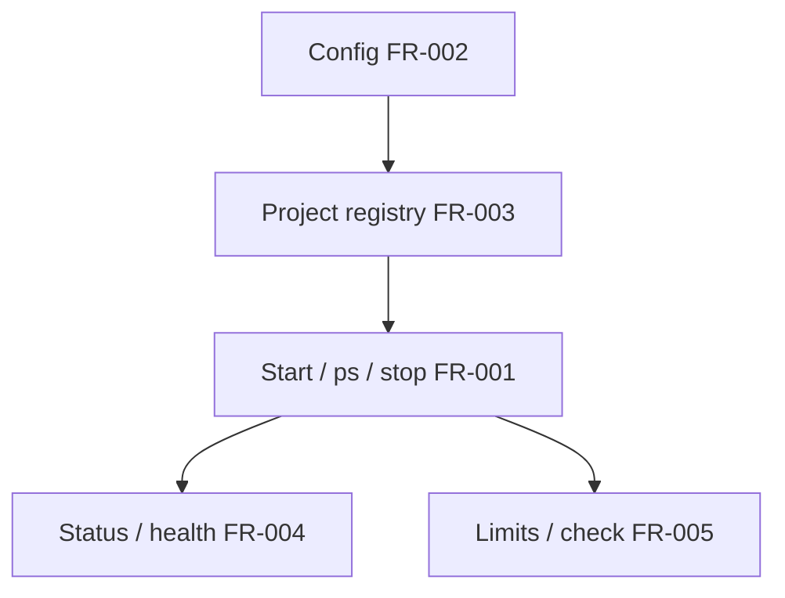

# sharecli User Journeys

> Visual workflows for sharecli. Each journey maps to FR IDs so agents can
> detect story gaps (see also [`docs/friction-log.md`](../friction-log.md)).

## Quick Navigation

| Journey | Time | Complexity | Primary FRs | Status |
|---------|------|------------|-------------|--------|
| [Quick Start](./quick-start) | 5 min | Beginner | FR-001, FR-002, FR-003 | Ready — `tests/quick_start_journey.rs` |
| Core Integration | 15 min | Intermediate | FR-001, FR-004, FR-005 | Planned |
| Production Setup | 30 min | Advanced | FR-004, FR-005, NFR-001..003 | Planned |

## Journey → FR map

| Step (happy path) | Command / action | FR |
|-------------------|------------------|----|
| Install binary | `cargo install sharecli` / `cargo build --release` | NFR-001 |
| Init config | `sharecli config init` | FR-002 |
| Register project | `sharecli project add <name> <path>` | FR-003 |
| Start process | `sharecli start <project> --harness <harness>` | FR-001 |
| List processes | `sharecli ps` | FR-001 |
| Check health | `sharecli status` / `sharecli health` | FR-004 |
| Set limits | `sharecli limits <project> --memory <mb>` | FR-005 |
| Stop | `sharecli stop --all` | FR-001 |

## Architecture

## Performance

| Metric | P50 | P95 |
|--------|-----|-----|
| Cold Start | < 10ms | < 50ms |
| Hot Path | < 1ms | < 5ms |
