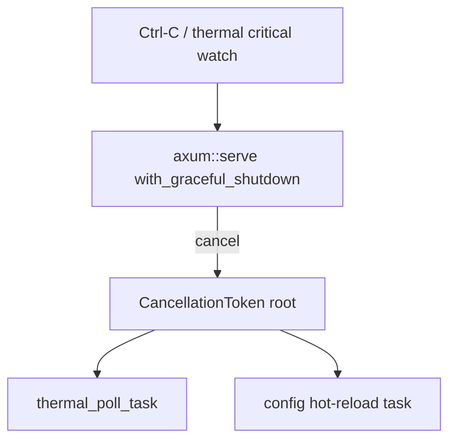

# Async shutdown & cancellation (C00 L4)

Audit-v38 **C00 L4** — structured concurrency for `sharecli serve` and scoped
spawn env overrides.

## Serve shutdown graph



| Component | Mechanism | File |
|-----------|-----------|------|
| HTTP listener | `axum::serve(...).with_graceful_shutdown(...)` | `src/commands/serve.rs` |
| Shutdown driver | `serve_shutdown_signal` (Ctrl-C + thermal watch) | `src/shutdown.rs` |
| Background tasks | `CancellationToken::child_token()` + `select!` | `serve.rs` thermal + config tasks |
| OTel flush | `crate::otel::shutdown()` after graceful stop | `serve.rs` |

### Operator behavior

1. **Ctrl-C** — in-flight HTTP requests drain; background pollers stop; serve lock released.
2. **Thermal RED** — `shutdown_tx` watch fires; same graceful path as Ctrl-C.
3. **`/readyz`** — returns 503 once shutdown is requested (existing probe contract).

Local smoke:

```bash
sharecli serve 127.0.0.1:0 &
curl -sf http://127.0.0.1:<port>/healthz
kill -INT $!
```

## Spawn env scoping (ProcessPool)

`ProcessSpawnSpec` (substrate) does not carry per-child env yet. Build harness
overrides (`CARGO_BUILD_JOBS`, `RUSTC_WRAPPER`, W3C `traceparent`) are applied
inside `tokio::task::spawn_blocking` with RAII `EnvGuard` restoration — env
mutation never spans async `.await` points on the Tokio worker pool.

See `src/runtime.rs` `ProcessPool::spawn` and `EnvGuard`.

## Related

- Concurrency / loom: [`concurrency.md`](concurrency.md)
- Serve rate limits: [`rate-limits.md`](rate-limits.md)
