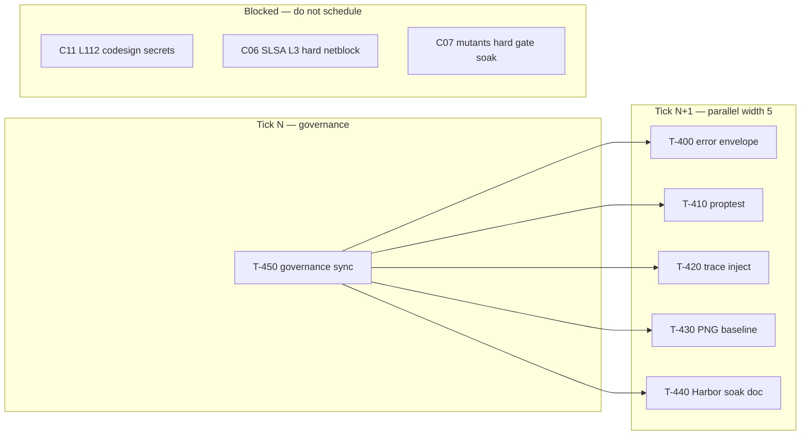

# PERT-DAG — Wave 12 (audit-v38 → 82% B target)

**Status:** ACTIVE  
**Base:** `main` @ `9e805b6` · SCORECARD **~80% B** (weighted)  
**Method:** AgilePlus sync — WBS row → GAP-QA row → WORK_DAG T-ID → FR PR → worklog  
**RC pin:** [`RC-audit-v38-80B.md`](./RC-audit-v38-80B.md)

## PERT estimates (optimistic / likely / pessimistic, hours)

| T-ID | Task | O | M | P | Critical path? |
|------|------|---|---|---|----------------|
| T-400 | C00 error envelope unify (serve 4xx/5xx) | 2 | 4 | 8 | **yes** |
| T-410 | C07 proptest root dep + config roundtrip | 1 | 3 | 6 | no |
| T-420 | C05 traceparent CLI inject (one path) | 2 | 4 | 6 | no |
| T-430 | C10 committed PNG baseline (dashboard) | 2 | 5 | 10 | no |
| T-440 | C08 Harbor Phase 3 soak (7d soft) | 1 | 2 | 4 | no |
| T-450 | Governance sync (WBS/GAP/DAG/RC) | 1 | 2 | 3 | **yes** |

**Critical path (serial):** T-450 → T-400 → scorecard reconcile → **~6–11h** to next table lift.

## Parallel DAG (width 4–5 per tick)

## Soft-ignore CI (merge policy)

codesign · Sonar · Kilo · Tray Win/macOS · DCO · gpg-soft · mutants · miri · RSS · load · hermetic · cosign · Playwright · CodeRabbit

**Hard gates:** `cargo build` ubuntu · `cargo clippy` · `cargo fmt` · FR body lint

## Done-when (Wave 12 exit)

1. WBS Wave11 rows **DONE**; GAP-QA reflects Jul-17 merges (#290–#324).
2. At least **two** of T-400..T-440 merged with scorecard append.
3. C00 and/or C08 cluster pct bumps reflected in SCORECARD reconcile PR.
4. RC doc updated if overall crosses **81%** unweighted.
