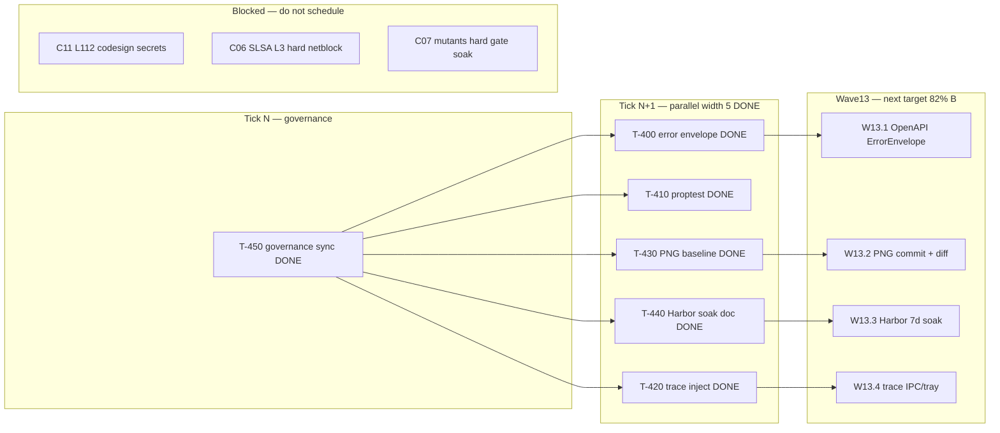

# PERT-DAG — Wave 12 (audit-v38 → 82% B target)

**Status:** DONE  
**Base:** `main` @ `03391c4` · SCORECARD **~81% B** (weighted) post-reconcile  
**Method:** AgilePlus sync — WBS row → GAP-QA row → WORK_DAG T-ID → FR PR → worklog  
**RC pin:** [`RC-audit-v38-80B.md`](./RC-audit-v38-80B.md)  
**Next:** Wave13 hard gates — see [`WBS-PHASED.md`](./WBS-PHASED.md) W13.1–W13.5

## PERT estimates (optimistic / likely / pessimistic, hours)

| T-ID | Task | O | M | P | Critical path? | Status |
|------|------|---|---|---|----------------|--------|
| T-400 | C00 error envelope unify (serve 4xx/5xx) | 2 | 4 | 8 | **yes** | DONE (#330) |
| T-410 | C07 proptest root dep + config roundtrip | 1 | 3 | 6 | no | DONE (#329) |
| T-420 | C05 traceparent CLI inject (one path) | 2 | 4 | 6 | no | DONE (#328) |
| T-430 | C10 committed PNG baseline (dashboard) | 2 | 5 | 10 | no | DONE (#327) |
| T-440 | C08 Harbor Phase 3 soak (7d soft) | 1 | 2 | 4 | no | DONE (#326) |
| T-450 | Governance sync (WBS/GAP/DAG/RC) | 1 | 2 | 3 | **yes** | DONE (#325) |

**Actual critical path:** T-450 (#325) → parallel T-400..T-440 (#326–#330) → governance reconcile PR.

## Parallel DAG (width 4–5 per tick)

## Soft-ignore CI (merge policy)

codesign · Sonar · Kilo · Tray Win/macOS · DCO · gpg-soft · mutants · miri · RSS · load · hermetic · cosign · Playwright · CodeRabbit

**Hard gates:** `cargo build` ubuntu · `cargo clippy` · `cargo fmt` · FR body lint

## Done-when (Wave 12 exit) — satisfied

1. WBS Wave11 rows **DONE**; GAP-QA reflects Jul-17 merges (#290–#324). ✓
2. All T-400..T-440 merged with scorecard append (#326–#330). ✓
3. C00/C05/C08/C10 cluster pct bumps in SCORECARD reconcile PR. ✓
4. RC doc updated — weighted overall crosses **81%** B. ✓
